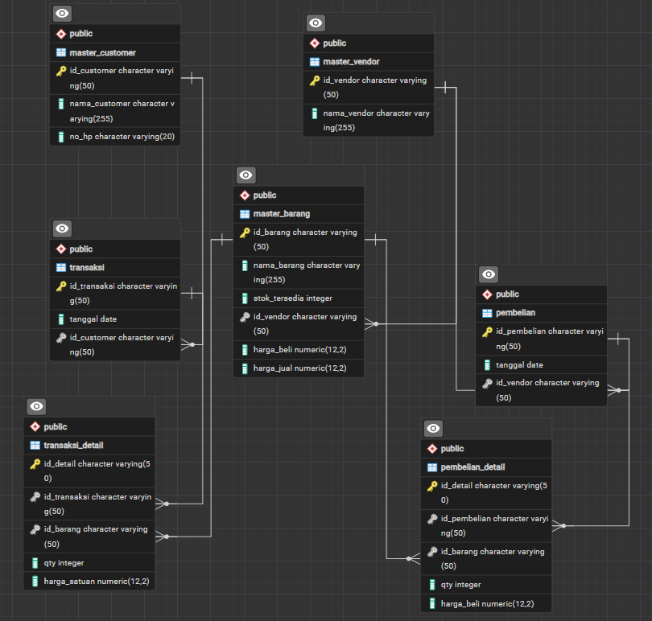

# 🏢 Mini Enterprise Resource Planning (ERP) System

A lightweight, enterprise-oriented **Mini ERP Core System** built to simulate core supply chain and business transaction flows. This project models the fundamental relationships between **Master Data**, **Procurement (Inbound)**, and **Sales (Outbound)** using clean relational database principles.

Developed by **Jose Purba**  
*Undergraduate Informatics Student at Institut Teknologi Del (IT Del)*

---

## 📌 Business Overview & SAP Equivalence

This system replicates core ERP operational logic commonly found in enterprise platforms like SAP:
- **Master Data Management (MDG):** Centralized management of Vendors, Customers, and Material/Inventory Master.
- **Procurement / Material Management (MM):** Handling purchasing documents and inbound inventory flow from Vendors.
- **Sales & Distribution (SD):** Header-and-detail transaction mechanism handling multi-item orders for Customers.

---

## 🗄️ Database Architecture (ERD)

Designed and modeled using **PostgreSQL**, adhering to standard relational normalization and enterprise design patterns.

  
*(Note: ERD generated directly from pgAdmin relational schema)*

### 1. Master Data Layer
* `master_vendor`: Stores vendor identities for procurement.
* `master_customer`: Stores customer profile information.
* `master_barang`: Centralized inventory master containing stock levels, pricing (buy/sell), and linkage to supplying vendors.

### 2. Procurement Layer (Inbound)
* `pembelian` *(Header)*: Records purchase order meta-data (ID, date, vendor).
* `pembelian_detail` *(Line Items)*: Handles line-item details including target inventory ID, ordered quantities, and purchasing price.

### 3. Transaction Layer (Outbound/Sales)
* `transaksi` *(Header)*: Records sales transaction meta-data (ID, date, customer).
* `transaksi_detail` *(Line Items)*: Handles line-item details including target inventory ID, ordered quantities, and selling price.

---

## 🛠️ Tech Stack

* **Database:** PostgreSQL (Modeled via pgAdmin)
* **Backend:** Python (FastAPI - *In Progress*)
* **Frontend:** React.js / Next.js (*Planned*)
* **Architecture:** Relational Schema, RESTful API, Micro-ERP Design

---

## 🚀 Project Roadmap

- [x] Initial Relational ERD & Database Schema definition
- [x] Database Dictionary (`schema.sql`) and Seeding (`seed.sql`)
- [ ] Implement CRUD APIs for Master Data (Vendor, Customer, Inventory)
- [ ] Implement Order Processing Engine with atomic stock deduction
- [ ] Periodic Financial & Inventory Ledger Reporting (Profit/Loss)
- [ ] Web-based Management Dashboard (Next.js)

---

## 👨‍💻 Author

**Jose Purba**  
- **Major:** Informatics (Teknik Informatika)
- **Institution:** Institut Teknologi Del (IT Del), Laguboti, Indonesia